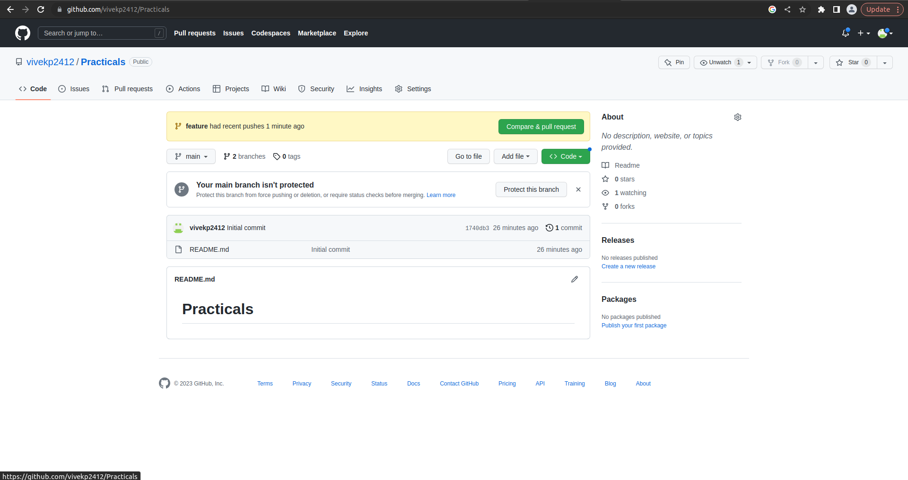
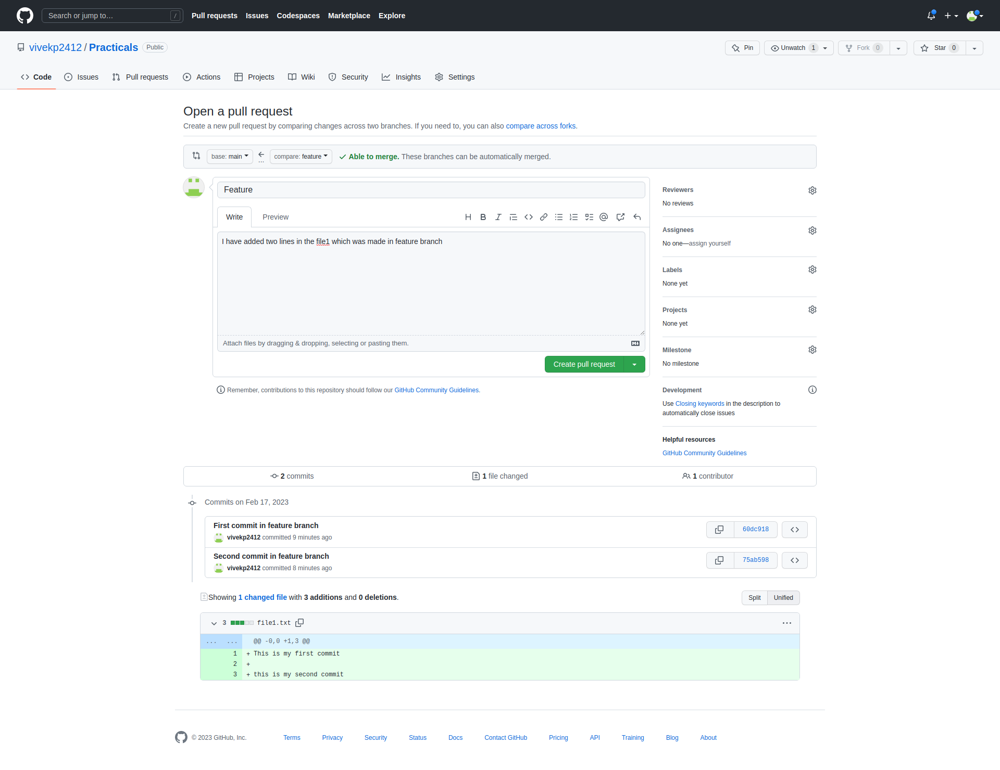
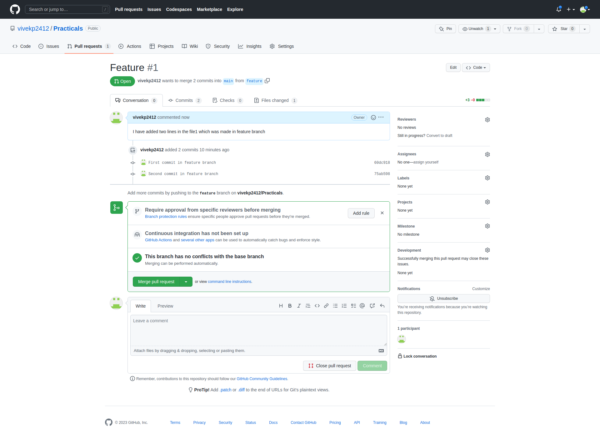
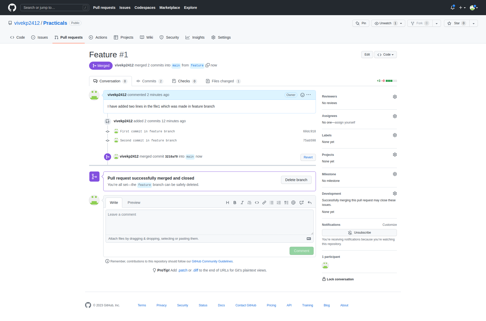
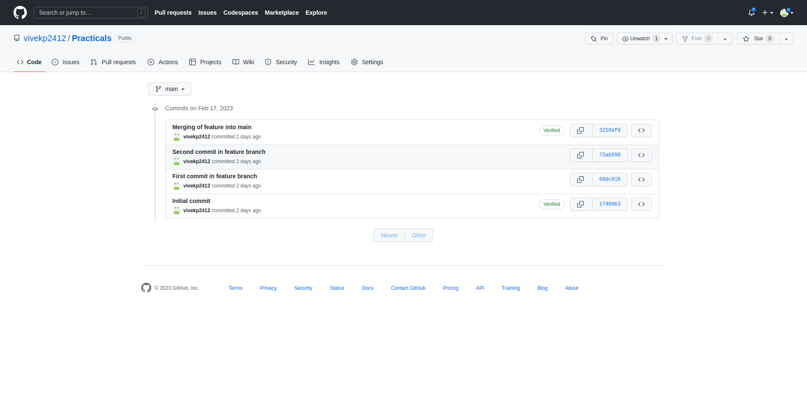
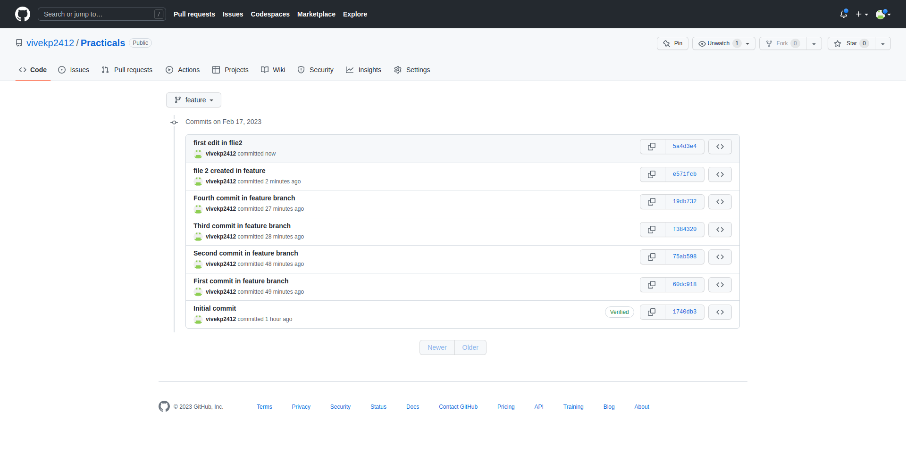
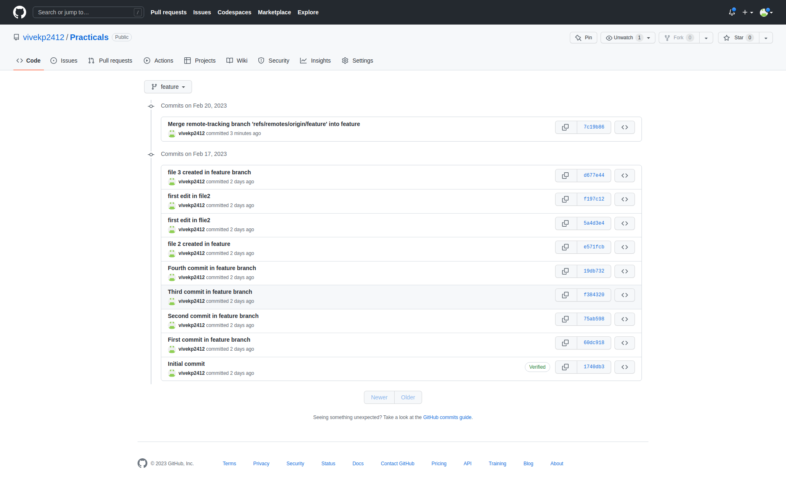

# Practicals
### 1. Pull and Merge difference-

 **Make example of pull request and two branch merge event.**

1) Create a branch named Feature from Main Branch.

2) Then made 2 commit in feature branch

3) Then after I pushed the feature branch into remote repository and generated pull request.







### Merging feature → main



### After Merging Commits in Main Branch



## And then in the terminal the “ git log —oneline —graph ”

vivek@sf-cpu-577:~/Desktop/Practicals$ git log --oneline --graph

- 3210af0 (HEAD -> main, origin/main, origin/HEAD) Merging of feature into main
|\
| * 75ab598 (origin/feature, feature) Second commit in feature branch
| * 60dc918 First commit in feature branch
|/
- 1740db3 Initial commit
vivek@sf-cpu-577:~/Desktop/Practicals$

### 2. Rebase-

**Try to rebase feature branch with master branch**

- Made 2 more commit in feature branch

```jsx
vivek@sf-cpu-577:~/Desktop/Practicals$ git checkout feature
Switched to branch 'feature'
Your branch is up to date with 'origin/feature'.
vivek@sf-cpu-577:~/Desktop/Practicals$ git commit -am "Third commit in feature branch"
[feature f384320] Third commit in feature branch
 1 file changed, 2 insertions(+)
vivek@sf-cpu-577:~/Desktop/Practicals$ git commit -am "Fourth commit in feature branch"
[feature 19db732] Fourth commit in feature branch
 1 file changed, 2 insertions(+)
```

- Made 2 commit in main branch

```jsx
vivek@sf-cpu-577:~/Desktop/Practicals$ git checkout main
Switched to branch 'main'
Your branch is up to date with 'origin/main'.
vivek@sf-cpu-577:~/Desktop/Practicals$ git commit -am "m1 commit in main branch"
[main 4f09bb0] m1 commit in main branch
 1 file changed, 10 insertions(+)
vivek@sf-cpu-577:~/Desktop/Practicals$ git commit -am "m2 commit in main branch"
[main fe42030] m2 commit in main branch
 1 file changed, 2 insertions(+)
```

- Rebasing the feature branch into main branch

```jsx
vivek@sf-cpu-577:~/Desktop/Practicals$ git rebase feature
Auto-merging file1.txt
CONFLICT (content): Merge conflict in file1.txt
error: could not apply 4f09bb0... m1 commit in main branch
hint: Resolve all conflicts manually, mark them as resolved with
hint: "git add/rm <conflicted_files>", then run "git rebase --continue".
hint: You can instead skip this commit: run "git rebase --skip".
hint: To abort and get back to the state before "git rebase", run "git rebase --abort".
Could not apply 4f09bb0... m1 commit in main branch
vivek@sf-cpu-577:~/Desktop/Practicals$ git add .
vivek@sf-cpu-577:~/Desktop/Practicals$ git rebase --continue
[detached HEAD 4284dac] m1 commit in main branch
 1 file changed, 12 insertions(+)
Auto-merging file1.txt
CONFLICT (content): Merge conflict in file1.txt
error: could not apply fe42030... m2 commit in main branch
hint: Resolve all conflicts manually, mark them as resolved with
hint: "git add/rm <conflicted_files>", then run "git rebase --continue".
hint: You can instead skip this commit: run "git rebase --skip".
hint: To abort and get back to the state before "git rebase", run "git rebase --abort".
Could not apply fe42030... m2 commit in main branch
vivek@sf-cpu-577:~/Desktop/Practicals$ git add .
vivek@sf-cpu-577:~/Desktop/Practicals$ git commit "rebasing done"
error: pathspec 'rebasing done' did not match any file(s) known to git
vivek@sf-cpu-577:~/Desktop/Practicals$ git commit -m"rebasing done"
[detached HEAD 58c25a0] rebasing done
 1 file changed, 3 insertions(+)
```

- Now to see the flow of commit We use “git log —oneline” and the terminal looks as below

```jsx
vivek@sf-cpu-577:~/Desktop/Practicals$ git commit -m"rebasing done"
[detached HEAD 58c25a0] rebasing done
 1 file changed, 3 insertions(+)
vivek@sf-cpu-577:~/Desktop/Practicals$ git log --oneline
58c25a0 (HEAD) rebasing done
4284dac m1 commit in main branch
19db732 (feature) Fourth commit in feature branch
f384320 Third commit in feature branch
75ab598 (origin/feature) Second commit in feature branch
60dc918 First commit in feature branch
1740db3 Initial commit
```

- Just for the sake of understanding the sequence of commit easily I have changed the commit of last commit from “rebasing done” to “m2 commit in main branch”

```jsx
vivek@sf-cpu-577:~/Desktop/Practicals$ git commit --amend
[detached HEAD 0aca2ac] m2 commit in master
 Date: Fri Feb 17 17:14:23 2023 +0530
 1 file changed, 3 insertions(+)
vivek@sf-cpu-577:~/Desktop/Practicals$ git log --oneline
0aca2ac (HEAD) m2 commit in master
4284dac m1 commit in main branch
19db732 (feature) Fourth commit in feature branch
f384320 Third commit in feature branch
75ab598 (origin/feature) Second commit in feature branch
60dc918 First commit in feature branch
1740db3 Initial commit
vivek@sf-cpu-577:~/Desktop/Practicals$
```

## 3. Change commit message-

**Commit push on commit in feature branch and then cha nge commit message**

- Created and modified file2.txt but in commit I made spell mistake for file2.txt and push that into remote
- Commit in remote repository are as below



- Now I changed the commit message with amend command and pushed into remote and now Commit message in remote are as



METHOD 2:

- This is also a way to change message using “rebase” and “reword”

```jsx
vivek@sf-cpu-577:~/Desktop/Practicals$ git rebase -i HEAD~2
[detached HEAD 0dd9e50] file 2 created in feature branch
 Date: Fri Feb 17 17:28:40 2023 +0530
 1 file changed, 0 insertions(+), 0 deletions(-)
 create mode 100644 file2.txt
Successfully rebased and updated refs/heads/main.
vivek@sf-cpu-577:~/Desktop/Practicals$ git log --oneline
d9186c9 (HEAD -> main) first edit in file2
0dd9e50 file 2 created in feature branch
19db732 Fourth commit in feature branch
f384320 Third commit in feature branch
75ab598 Second commit in feature branch
60dc918 First commit in feature branch
1740db3 Initial commit
```

## 4. cherry pick-

**Pick some commits from feature branch to master branch**

- I am checkout into feature branch and made a file3 in that branch and made commit in that branch

```jsx
vivek@sf-cpu-577:~/Desktop/Practicals$ git checkout feature
Switched to branch 'feature'
Your branch and 'origin/feature' have diverged,
and have 1 and 1 different commits each, respectively.
  (use "git pull" to merge the remote branch into yours)
vivek@sf-cpu-577:~/Desktop/Practicals$ touch file3.txt
vivek@sf-cpu-577:~/Desktop/Practicals$ git add .
vivek@sf-cpu-577:~/Desktop/Practicals$ git commit -m "file 3 created in feature branch"
[feature d677e44] file 3 created in feature branch
 1 file changed, 0 insertions(+), 0 deletions(-)
 create mode 100644 file3.txt
```

- Now I switched to main branch and now using cherry-pick command I got that file in main branch as well.We can see the files by “ls” command

```jsx
vivek@sf-cpu-577:~/Desktop/Practicals$ git checkout master
error: pathspec 'master' did not match any file(s) known to git
vivek@sf-cpu-577:~/Desktop/Practicals$ git checkout main
Switched to branch 'main'
Your branch and 'origin/main' have diverged,
and have 4 and 1 different commits each, respectively.
  (use "git pull" to merge the remote branch into yours)
vivek@sf-cpu-577:~/Desktop/Practicals$ git cherry-pick d677e446954114cf219396366bc7b76373acccca 
[main 7a9993c] file 3 created in feature branch
 Date: Fri Feb 17 17:42:36 2023 +0530
 1 file changed, 0 insertions(+), 0 deletions(-)
 create mode 100644 file3.txt
vivek@sf-cpu-577:~/Desktop/Practicals$ ls
file1.txt  file2.txt  file3.txt  README.md
```

## 5. Drop commit- Remove some commit from feature branch.

- Modified File3.txt and then made a commit and pushed it to remote

```jsx
vivek@sf-cpu-577:~/Desktop/Practicals$ cat file3.txt
hey there
vivek@sf-cpu-577:~/Desktop/Practicals$ git commit -am "file 3 edited"
[feature 5769bda] file 3 edited
 1 file changed, 1 insertion(+)
vivek@sf-cpu-577:~/Desktop/Practicals$ git push origin feature
Username for 'https://github.com': vivekp2412
Password for 'https://vivekp2412@github.com': 
Enumerating objects: 5, done.
Counting objects: 100% (5/5), done.
Delta compression using up to 8 threads
Compressing objects: 100% (2/2), done.
Writing objects: 100% (3/3), 259 bytes | 259.00 KiB/s, done.
Total 3 (delta 1), reused 0 (delta 0), pack-reused 0
remote: Resolving deltas: 100% (1/1), completed with 1 local object.
To https://github.com/vivekp2412/Practicals.git
   7c19b86..5769bda  feature -> feature
```

- Now to drop the commit we will use reset —hard

 

```jsx
vivek@sf-cpu-577:~/Desktop/Practicals$ git reset --hard 7c19
HEAD is now at 7c19b86 Merge remote-tracking branch 'refs/remotes/origin/feature' into feature
vivek@sf-cpu-577:~/Desktop/Practicals$ cat file3.txt
vivek@sf-cpu-577:~/Desktop/Practicals$
```
